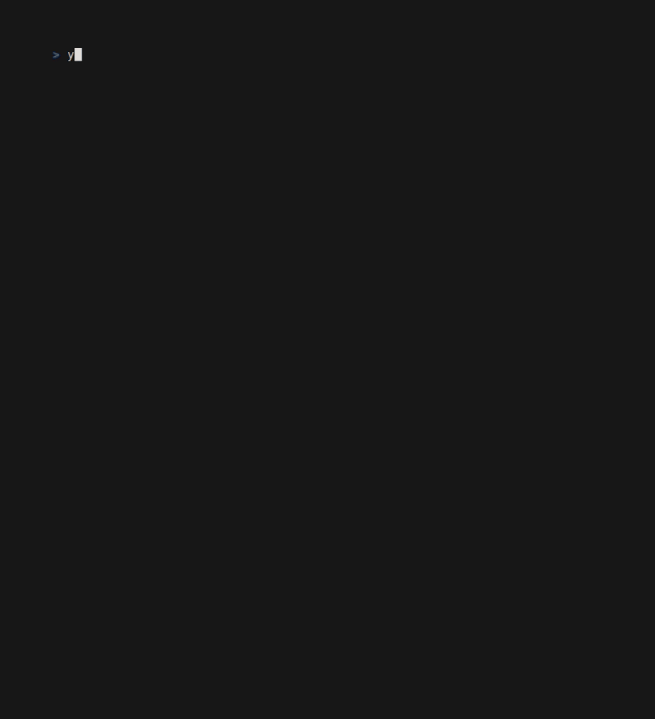

# Desassossego 📖

**Desassossego** is a sleek, minimalist CLI tool designed to immerse readers in the fragmented world of *O Livro do Desassossego* (*The Book of Disquiet*) by Fernando Pessoa. This program lets you explore the 433 fragments of Pessoa's masterpiece in an intuitive and distraction-free way.

---

## **Demo**
  
*Above: Check out the suaveness.*

---

## Features 🌟
- **Fragment Navigation**: Enter the fragment number (1-433) to read any part of the book.
- **Keyboard Shortcuts**:
  - **`n`**: Next fragment.
  - **`p`**: Previous fragment.
  - **`b`**: Back to the fragment picker.
  - **`q`**: Quit the program anytime.
- **Local JSON Storage**: The fragments are stored in `frags/ldd.json`, ensuring fast and offline access.
- **Elegant & Simple**: A no-frills design that puts the text front and center.

---

## Getting Started 🚀

### Prerequisites
- **Go**: Make sure [Go](https://golang.org/) is installed on your system.

### Installation
1. **Clone the repository**:
   ```bash
   git clone https://github.com/bxavaby/desassossego.git
   cd desassossego
   ```
2. **Edit the absolute path to ldd.json in senon.go if you plan to run the program from a different directory:**
   ```bash
   fragments, err := ui.LoadFragments(
   		"frags/ldd.json",   // relative
   		"~/frags/ldd.json", // replace with your absolute path
   	)
   ```
3. **Build the Program**:
   ```bash
   go build -o desassossego
   ```
4. **Move the Executable**:
   ```bash
   sudo mv desassossego /usr/local/bin/
   ```
5. **Run the Program**:
   ```bash
   desassossego
   ```
---

## **Project Structure**
```plaintext
.
├── frags
│   └── ldd.json      # the 433 fragments
├── senon.go          # entry point
└── ui
    ├── dsp.go        # display-related
    ├── nav.go        # navigation
    └── stl.go        # style
```

---

## Future Plans 🔮
- **SSH Book Server**: Transform "Desassossego" into an SSH-accessible book server for remote exploration.
- **Expanded Catalogue**: Use it as a template for other cli-suitable books.

---

## License 📜
This project is licensed under the MIT License. See the LICENSE file for details.

---

## Acknowledgments 🙌
- Inspired by *O Livro do Desassossego* (*The Book of Disquiet*), Fernando Pessoa.
